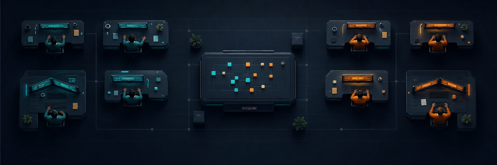

<p align="center">
  
</p>

<h1 align="center">Agent World</h1>

<p align="center">
  <strong>A native command room for AI coding harnesses.</strong><br>
  Run independent Codex and Claude threads as visible operators—without carrying an Electron city on your back.
</p>

<p align="center">
  <a href="https://github.com/Viseriontarg/agent-world/actions/workflows/ci.yml"></a>
  
  
  
  <a href="LICENSE"></a>
</p>

<p align="center">
  <a href="#the-idea">Idea</a> ·
  <a href="#what-exists-today">What exists</a> ·
  <a href="#lean-by-measurement">Measurements</a> ·
  <a href="#quick-start">Quick start</a> ·
  <a href="docs/ARCHITECTURE.md">Architecture</a> ·
  
  <a href="#roadmap">Roadmap</a>
</p>

---

## The idea

Most multi-agent tools make concurrent work feel like managing browser tabs. Agent World makes it spatial:

- a **project** is a room;
- a **Git worktree** is a workstation;
- a **thread** is an operator;
- Codex and Claude are provider capabilities, not the character's identity.

The interface is only a projection. SQLite, command receipts, provider cursors, and Git remain the source of truth.
The shipped interface is list-first: all operators remain reachable in a standard, scrollable,
keyboard-focusable control while the room/workstation metaphor stays in the domain model.

## What exists today

This repository is the completed Phase‑1 executable slice—not a mock-up.

| ✅ Proven now | ⏳ Deliberately not claimed yet |
|---|---|
| Native `eframe/egui` application using the single `glow` renderer | Live model turns |
| Responsive, focusable operator list with 50-actor fixture | Approval and user-input round trips |
| Standard keyboard traversal, prompt persistence, guarded interruption, and AccessKit | Resume/fork context integrity |
| One SQLite writer with bounded `sync_channel(8/32)` queues | T3 migration |
| Durable events, projections, receipts, and payload-conflict rejection | Autonomous agent-to-agent loops |
| Native Git worktree creation with crash reconciliation | Terminal, browser, PR, or remote surfaces |
| Zero-turn Codex app-server and Claude CLI capability probes | Feature parity with T3 |

If the UI says a live provider turn is unavailable, that is intentional. **Agent World does not fake lifecycle proof.**

## Lean by measurement

> **Measurement status:** the figures below are the published baseline for the original
> Phase‑1 spatial interface. The current list-first interface has not yet completed its
> required Windows measurement rerun, so these are historical comparison numbers—not a
> claim about the current executable.

Baseline fixture: 5 projects, 50 visible actors, 20,000 persisted messages, no live provider or terminal.

| Gate | Result | Limit | |
|---|---:|---:|:--|
| Startup to interactive window | **1.023 s** | ≤ 3 s | ✅ |
| Peak private memory | **75.87 MB** | ≤ 250 MB | ✅ |
| Average idle CPU | **0.026%** | ≤ 0.5% | ✅ |
| Node processes at idle | **0** | 0 | ✅ |
| Process per idle actor | **No** | No | ✅ |

The first DX12/wgpu shell measured 366.45 MB and was rejected. The production renderer is `glow`; there is no second renderer to maintain.

> `scripts/measure.ps1` measures the current executable on your machine. Its next published
> Windows result will replace this baseline; [measurement challenges remain welcome](.github/ISSUE_TEMPLATE/measurement_challenge.yml).

## How it works

```text
agent-world.exe
├─ eframe / egui / glow / AccessKit
│  ├─ scrollable operator list
│  └─ selected workspace: timeline · prompt · provider readiness
├─ bounded UI → core command queue
├─ single orchestration + SQLite writer thread
│  ├─ durable command receipts and events
│  ├─ bounded timeline projections
│  └─ native Git worktree reconciliation
├─ bounded core → UI event queue
└─ lazy provider probes
   ├─ codex app-server
   └─ Claude CLI
```

Worktree intent is committed before Git runs. The immutable plan records the repository, common directory, path, branch, and full commit OID. Restart recovery proves both dangerous windows:

1. crash after durable acceptance but before Git;
2. crash after Git but before the terminal SQLite transaction.

Mismatched Git state becomes `indeterminate`; Agent World does not reset, prune, delete, or force its way through uncertainty.

**→ [`docs/ARCHITECTURE.md`](docs/ARCHITECTURE.md)** covers the thread model, the durable schema, the worktree recovery sequence, and exactly what each provider probe does and does not verify.

## Quick start

### Prerequisites

- Windows 11
- Rust 1.95+ MSVC (`rust-version = 1.95`)
- Visual C++ Build Tools and a Windows SDK
- Git
- Optional probes: installed `codex` and `claude` CLIs

```powershell
git clone https://github.com/Viseriontarg/agent-world.git
cd agent-world
cargo build --release
.\target\release\agent-world.exe
```

Runtime data defaults to `%LOCALAPPDATA%\AgentWorld`.

> **Note**
> The bundled SQLite compiles from source, so `cl.exe` must be on `PATH`. Build from a
> **Developer PowerShell for VS**, or run `vcvars64.bat` first.

### Controls

| Input | Action |
|---|---|
| Click or `1`–`9` | Select an operator (`1`–`9` only when no control has focus) |
| `Enter` | Focus the prompt when no control has focus |
| `Ctrl+Enter` | Save the selected prompt to the durable timeline |
| `Ctrl+.` | Request interruption when the selected operator is interruptible |
| `F6` | Cycle operators requiring attention |
| `Tab` / `Shift+Tab` | Move keyboard focus through every control and operator |

## Prove it locally

```powershell
.\target\release\agent-world.exe --self-check
.\target\release\agent-world.exe --probe-providers
.\scripts\measure.ps1 -WarmupSeconds 300 -SampleSeconds 60
```

`--self-check` creates disposable Git repositories and worktrees to verify idempotency and both crash-recovery windows. Provider probes initialize no model turn. The resource script uses a unique temporary runtime root and removes it afterward.

## Roadmap

- [x] Native operator list, bounded queues, SQLite proof, Git worktree proof
- [x] Zero-turn Codex and Claude protocol-surface probes
- [x] Historical Phase‑1 resource baseline under 250 MB / 0.5% CPU
- [ ] Publish the Windows resource rerun for the current list-first interface
- [ ] Live provider lifecycle: stream, approve, interrupt, resume, fork
- [ ] Full orchestration lifecycle and per-worktree leases
- [ ] Directed, user-confirmed handoffs
- [ ] Read-only T3 import and verified independence
- [ ] Terminals, attachments, richer Markdown, and repository surfaces

## Why public this early?

Because architecture is easier to trust when the uncomfortable measurements and unfinished boundaries are visible. Issues, profiling evidence, protocol corrections, and sharp technical criticism are welcome.

The most useful thing you can do is run `scripts/measure.ps1` and tell me the numbers are wrong.

## Contributing

Read [CONTRIBUTING.md](CONTRIBUTING.md) first — it explains the budgets, the one editorial
rule, and what makes a pull request easy to accept. Security reports go through
[SECURITY.md](SECURITY.md).

## Licence

[MIT](LICENSE) © 2026 Aminreza Khoshbahar
