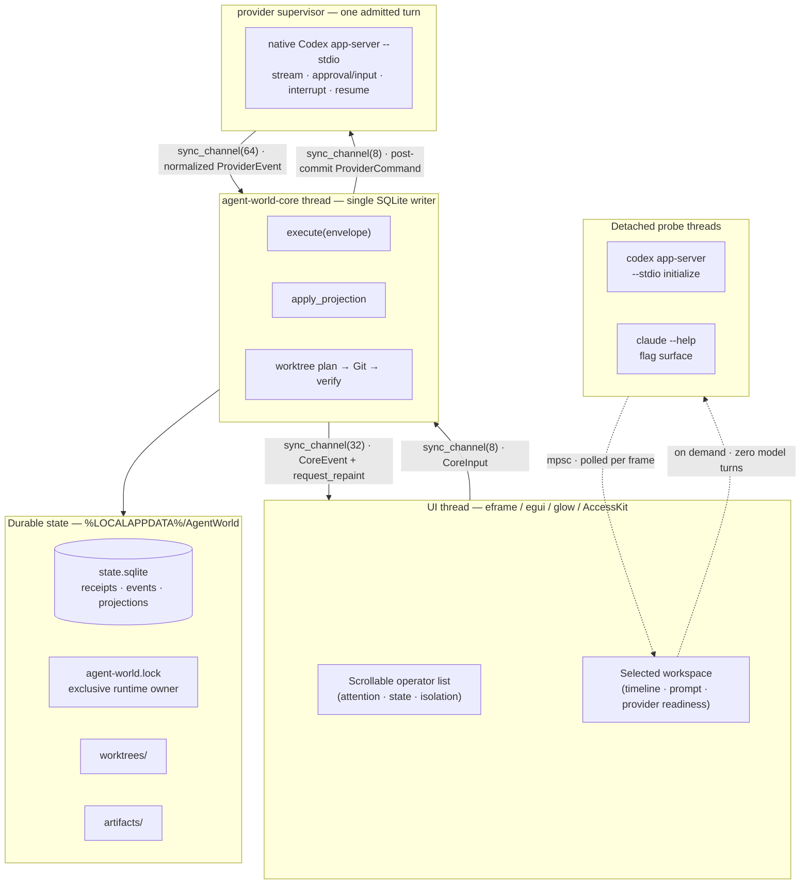
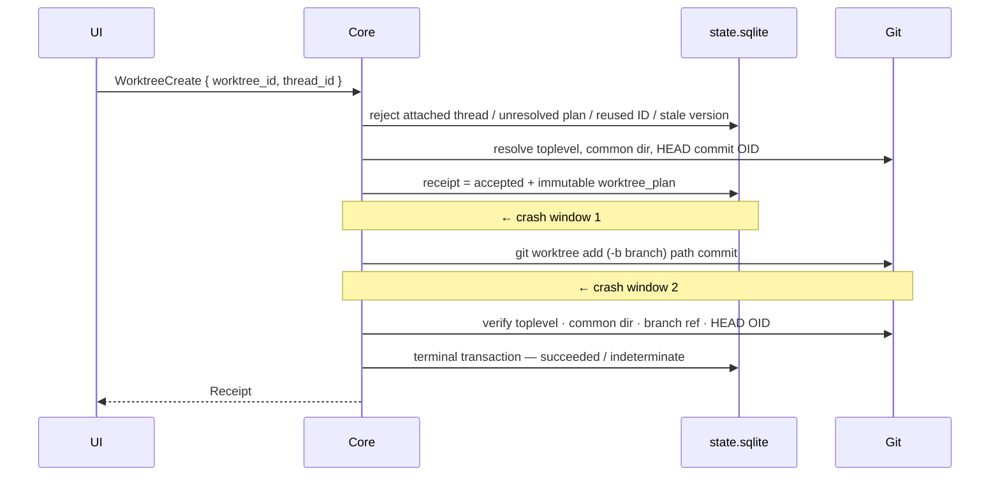

# Architecture

> Agent World is one long-lived application process, one window, one renderer, one writer
> thread, and one SQLite file. Bounded provider children exist only around explicit probes or the
> single admitted live turn. Everything below explains what that slice proves — and refuses to
> claim.

---

## 1. Shape of the process



The steady-state process has three long-lived threads. Provider probes and pipe readers are
transient and exist only while their bounded operation is active:

| Thread | Count | Owns |
|---|---:|---|
| UI | 1 | The window, operator list, selected workspace, all `egui` state |
| `agent-world-core` | 1 | The SQLite connection, Git invocation, projections |
| `agent-world-provider` | 1 | One-slot Codex admission and child lifecycle; idle while no turn runs |
| Provider probe | 0 or 1, transient | A short-lived child process, then exits |
| Provider pipe reader | 0 or 2, transient | Drains bounded stdout/stderr so the child cannot deadlock on a full pipe |

There is no thread pool, no async runtime, no process per actor, and no Node. Fifty visible
operators are fifty rows in a table, not fifty processes. At most one **live-turn** Codex tree is
admitted. The native child is attached to a Windows Job Object immediately after spawn and the
runtime bounds termination, root reap, worker join, and Job active-process accounting. The attach
is still post-spawn, so zero-race/no-orphan containment is an external Windows proof gate. Live
preflight and optional zero-turn probe children are separate from the one live-turn slot.

---

## 2. Bounded queues, on purpose

```rust
const COMMAND_CAPACITY: usize = 8;   // UI → core
const EVENT_CAPACITY:   usize = 32;  // core → UI
const PROVIDER_COMMAND_CAPACITY: usize = 8;
const PROVIDER_EVENT_CAPACITY:   usize = 64;
```

Both directions are `std::sync::mpsc::sync_channel`. The UI submits with `try_send`
and surfaces the error rather than blocking the frame; a full queue is a visible
condition, not an invisible backlog.

This is a design position. An unbounded channel would make the app feel fine right up
until memory ended. A bounded one makes backpressure a thing you can see in the status
bar on the very first frame it happens.

The live-turn path does not add an unbounded side channel. `LiveTurnStart` first commits the user
message, immutable worktree/policy plan, receipt, and `turn.accepted` event. Only a fresh receipt
yields a provider command, so replay cannot launch a second paid turn. A database index and core
validation enforce one globally active turn even though the bounded command queue has capacity
eight for start/approval/input/interrupt control messages. Normalized provider events are applied
transactionally; session IDs, cursors, interactions, output, and terminal state are durable
before the UI observes them.

The core wakes the UI explicitly — `wake_ui()` calls `request_repaint()` after each
event. The UI otherwise repaints only while something is genuinely in motion
(`request_repaint_after(66ms)` while a probe runs or an actor is starting, running, or
interrupting). Idle means idle.

The UI is list-first and uses standard focusable egui controls. All operators live in a
vertical `ScrollArea`; focused rows scroll into view, so the 50-operator fixture remains
reachable at the 900×560 minimum window. `Tab` and `Shift+Tab` stay with platform focus
traversal, `F6` cycles attention, and unmodified number shortcuts are disabled whenever
a widget owns focus. The selected workspace has an outer vertical scroll plus bounded
timeline and provider-result regions, so long paths and diagnostic output cannot make
the prompt unreachable.

---

## 3. Durability model

Every mutation enters as a `CommandEnvelope`: a `command_id`, a `PROTOCOL_VERSION`, and
a serialized `Command`. The core writes a **receipt** before anything else, and the
receipt is the unit of idempotency.

```
schema_migrations  version PK · applied_at  (mirrored by PRAGMA user_version = 2)
command_receipts   command_id PK · protocol_version · command_json · status
                   · result_json · event_sequence · recorded_at
events             sequence PK AUTOINCREMENT · aggregate_id · aggregate_version
                   · event_type · payload_json   UNIQUE(aggregate_id, aggregate_version)
worktree_plans     command_id PK → command_receipts · repo_path · repo_common_dir
                   · branch · path · commit_oid
aggregate_versions aggregate_id PK · version
projects           project_id PK · name · repo_path
worktrees          worktree_id PK · project_id → projects · branch · path UNIQUE · status
threads            thread_id PK · project_id → projects · worktree_id → worktrees
                   · provider · label · state · attention · unread_count
                   · last_event_sequence
messages           sequence PK → events · thread_id → threads · role · body · occurred_at
turns               turn_id PK · thread_id → threads · provider · provider_session_id (nullable until observed)
                    · immutable worktree_path · policy · status · prompt_sequence → messages
                    · started_sequence / terminal_sequence → events · bounded error · timestamps
```

Opening the store is a guarded operation, not `CREATE TABLE IF NOT EXISTS` and hope. An OS-held
exclusive lease is acquired for the runtime root before the database is opened or recovery runs;
a second process fails visibly instead of reconciling the first owner's live turn. Shutdown
cancels and joins the provider/core loops. If child, worker, Job accounting, or join termination
cannot be proven, the process intentionally retains the lease until process exit:

- schema versions `0` and `1` are migrated transactionally to version `2`, after a consistent
  `state.sqlite.pre-v2.bak` snapshot is created for a pre-existing database;
- a database newer than this binary is rejected before backup or journal-mode changes;
- required columns, `PRAGMA quick_check(1)`, and every row returned by
  `PRAGMA foreign_key_check` are validated before the core thread starts;
- the exact `turns` table and single-global-active partial-index definitions, lifecycle row
  shapes, allowed provider/policy/status values, byte caps, and active-row count are validated;
- legacy projection semantics are also checked: a non-null worktree can belong to at
  most one thread, and every accepted worktree plan must name the thread's project;
- the live connection uses WAL journalling, `synchronous=FULL`, a three-second busy
  timeout, and a bounded WAL autocheckpoint.

Three properties follow from that layout, and `--self-check` asserts all three:

1. **Replay is free.** Re-executing the same `command_id` with the same payload returns
   the original receipt and appends no second event.
2. **Altered replay is rejected.** Re-executing the same `command_id` with a *different*
   payload is refused rather than applied. A retry that quietly changed its mind is a
   bug in the caller, not an instruction.
3. **Ordering is enforced by the schema.** `UNIQUE(aggregate_id, aggregate_version)`
   makes a lost update a constraint violation instead of a silent overwrite.

Invalid mutations are durable rejections, not events. A command for a missing or
archived thread therefore records the failed attempt without inventing an aggregate
version or changing a projection.

`projects`, `worktrees`, `threads`, `messages`, and `turns` are **projections**. The interface
is a projection of a projection. Nothing is ever true only on screen.

### One live turn, with a deliberately bounded authority contract

Only Codex operators in an explicit admissible state with a `ready` isolated worktree can enter
the live path. Admission reloads the succeeded immutable worktree plan and re-verifies the
non-redirected destination, resolved toplevel, Git common directory, exact branch ref, and HEAD
OID. A partial unique SQLite index permits one active turn globally. The turn row binds the
internal UUID, thread, worktree path, prompt event, and policy
`isolated_workspace_write_on_request_v1` before any CLI is started. Active turns cannot be
archived.

The live runner accepts only a native `codex.exe`, requires exactly `codex-cli 0.146.0`, and runs
a bounded zero-model-turn version/effective-feature preflight before the prompt. The reviewed
denylist must be false and any unknown enabled feature fails closed. The child is a long-lived
`app-server --stdio` process. Thread start/resume requests declare `workspace-write`,
`on-request`, the canonical runtime workspace root, and no environments. Turn start repeats
`on-request` and supplies an explicit `workspaceWrite` sandbox policy: the canonical worktree is
the sole writable root, network access is false, and both temporary writable-root exclusion flags
(`excludeSlashTmp` and `excludeTmpdirEnvVar`) are true. Launch argv also disables web search and MCP servers, forbids login shells, uses core-only
shell environment inheritance, and disables the reviewed external-capability features.

This is an **intended isolated-worktree write contract**, not proof of Windows enforcement and
not a host-secret or worktree-only read boundary. File and command approval requests are durable,
inline, and answerable once; the adapter does not claim that every possible provider write will
request approval. Other user-readable host files may still be readable, and the prompt plus
model-selected context go to the configured Codex service. The provider itself necessarily uses
the network although sandboxed commands request `networkAccess: false`. Authenticated Windows
write-root/network/escalation enforcement and positive tool allowlisting remain release gates.

Codex generates provider thread and turn IDs. The adapter durably normalizes starting,
session/resume, coalesced assistant output, approval, user input, interrupt acknowledgement, and
terminal events. Provider event IDs are idempotency keys; changed payloads conflict, exact
duplicates do not duplicate timeline, interaction, or terminal records, and out-of-order state
transitions roll back. A completed session/cursor can be supplied to a later explicit turn;
unfinished work discovered after restart becomes `indeterminate` and is never replayed.

Stdout protocol lines, normalized deltas, stderr lines/tail, diagnostics, interaction text,
pending RPCs/interactions, and every channel are bounded. Assistant deltas are coalesced at the
adapter and again per core event batch so persistence is not one SQLite transaction per token.
Malformed JSON, unknown methods, oversized lines, uncorrelated responses, and premature process
exit fail closed; exit code zero without a terminal event is still process loss, never invented
completion. Root reap, worker joins, and Windows Job active-process accounting have bounded
cleanup. Any unproven termination revokes safe lease release for the rest of the process.

The automated matrix covers stream, allow, deny, multiline input, interrupt before correlation,
interrupt during stream, duplicate/out-of-order events, malformed/oversized/stderr cases,
premature exit, bounded crash diagnostics, and ten restart windows. This proves the deterministic
code path, not authenticated Windows provider equivalence, Narrator/NVDA usability, Job Object
leak freedom, or current desktop resource budgets. Fork and Claude live turns remain absent.

---

## 4. Git worktrees: intent before action

The dangerous part of creating a worktree is not Git. It is the gap between deciding
and doing, and the gap between doing and recording. Agent World commits the plan first,
so both gaps are recoverable.



On startup, `recover_accepted_worktrees()` replays every plan still sitting in
`accepted` and drives it to a terminal state:

- **Crash window 1** (durable acceptance, no Git yet) — the plan is complete, so the
  worktree is created on the next launch and verified.
- **Crash window 2** (Git ran, no terminal transaction) — the path already exists, so
  recovery verifies rather than recreates.

Verification is exact, not approximate. The destination must resolve to its planned final path
without a symlink/junction redirect or alias to the shared source. The resolved toplevel, Git
common directory, `refs/heads/<branch>`, and HEAD commit OID must also match. The same identity is
revalidated at every `LiveTurnStart` admission, before a provider command can be emitted. If the branch
already exists and points somewhere else, Agent World stops with
`worktree branch X points to Y, expected Z; refusing to reset it`.

Recovery is failure-isolated. One plan that cannot be reconciled becomes a visible
startup warning while other plans and the application continue. A conflicting legacy
accepted plan is moved to `indeterminate` before any Git command runs, so it cannot
retry forever or create an orphan branch/path.

A fresh worktree command is also rejected while its thread already has an accepted
plan. The rejection names the original command and worktree, is recorded as a receipt
without another event or aggregate version, and leaves the original durable plan
available for replay.

**Mismatch becomes `indeterminate`.** It does not `reset --hard`, prune, delete, or
force. An agent runner that silently repairs your Git state is a tool that will
eventually silently delete your work.

---

## 5. Providers: one bounded Codex lifecycle, external equivalence still gated

The UI can run one isolated-worktree Codex app-server turn with streaming and human-control
interactions. The separate
`--probe-providers` command remains a **zero-turn probe** of the protocol surface the installed
CLIs declare and reports `"paid_model_turns": 0` because that command never starts a turn.

**Codex live runner** — requires the reviewed native `codex.exe` (a `.cmd`/`.bat` wrapper is never
used for a model turn), the pinned version, and the effective-feature inventory described above.
This preflight is part of each admission and is not satisfied by a previous UI probe.

**Codex informational probe** — may resolve the installed CLI entrypoint, checks that `exec` help
declares JSONL/stdin/worktree/configuration/read-only flags, and validates the feature denylist.
It also runs a full `initialize` handshake over `app-server --stdio` with an 8-second deadline,
requires `userAgent`, `codexHome`, `platformFamily`, and `platformOs == "windows"`, and generates
protocol schemas for the broader future lifecycle. Probe success does not gate the button and a
probe process is not the live native-executable/Job proof.

**Claude** — asserts the installed CLI exposes its input/output/session/permission surface plus
safe-mode, tool allow-list, strict-MCP, slash-command, and Chrome-disable flags. Those are
capability declarations only; no Claude turn adapter is enabled in this slice.

Each probe reports three separate lists, and the separation is the point:

| Field | Means |
|---|---|
| `verified_without_model_turn` | Agent World executed this and it worked |
| `declared_by_installed_cli` | The installed binary says it supports this |
| `live_spike_still_required` | Nobody has proven this yet, including us |

Streaming, approval/input, interrupt, and completed-session resume are implemented and covered by
deterministic fixtures. Authenticated Codex equivalence on real Windows, fork context integrity,
and Claude live turns remain proof gates. Promotion of the current path requires a Windows evidence bundle containing the Windows
build/CLI version and native resolution, actual elevated/unelevated sandbox mode, exact launch
and effective-feature inventory, redacted raw JSONL, pre/post worktree/common-directory manifest,
read-scope attempts, process-tree counts after success/timeout/overflow/forced close, and reopened
SQLite turn/session/message state. Unit fixtures and CI cannot promote that claim.

---

## 6. Renderer

`eframe` with `default-features = false` and exactly three features: `accesskit`,
`default_fonts`, `glow`.

The first shell used DX12 via `wgpu` and measured **366.45 MB** private memory. It was
deleted rather than optimized. `glow` is the production renderer and there is no second
backend to keep alive, no feature flag to test twice, and no "it works on the other
path" bug class.

The interface uses immediate-mode standard widgets rather than a retained scene graph:
one focusable button per operator, scroll areas for long collections, and native text
editing for the prompt. Selection, focus traversal, attention cycling, allow/deny, multiline
answers, and interruption are keyboard-reachable in automated fixtures, and AccessKit is on.
That is not a Narrator or NVDA result.

Release profile: `codegen-units = 1`, `lto = "thin"`, `panic = "abort"`, `strip = true`.

---

## 7. What is deliberately absent

| Not here | Why |
|---|---|
| Async runtime | One writer thread and blocking `mpsc` are sufficient and legible |
| Second renderer | Measured, rejected, deleted |
| Node, Electron, webview | The resource gate is the product |
| Process per actor | Actors are rows; the measurement script asserts this |
| Fork and Claude live lifecycle | The implemented slice is one Codex app-server lifecycle; fork and Claude turns are not implemented or claimed |
| Worktree-only reads / secret isolation | The worktree scopes Git state and cwd, not all readable host files; do not place host secrets inside the claimed boundary |
| Authenticated Windows policy equivalence | Request shape is deterministic; effective write-root, network, escalation, and containment enforcement still need external evidence |
| Autonomous agent-to-agent loops | Handoffs will be directed and user-confirmed |
| Cross-platform builds | `where.exe`, `%LOCALAPPDATA%`, and Windows path handling are load-bearing today |

---

## 8. Verifying all of this yourself

```powershell
.\target\release\agent-world.exe --self-check        # idempotency, Git crash windows, fake-turn durability/no-replay
.\target\release\agent-world.exe --live-slice-self-check # lifecycle/crash/bounds/stress JSON; zero model turns
.\target\release\agent-world.exe --probe-providers   # protocol surface, zero model turns
.\scripts\measure.ps1 -WarmupSeconds 300 -SampleSeconds 60
```

`--self-check` builds disposable Git repositories under `%TEMP%` and configures its own
committer identity, so it touches nothing you own. `measure.ps1` seeds a unique
temporary runtime root, refuses to run against a path outside `%TEMP%\AgentWorldResource-*`,
and removes it afterwards. These fixtures do not authenticate a Windows Codex turn and do not
replace the external evidence bundle above.

Run them. Disagreeing with the numbers is a supported activity — see
[CONTRIBUTING.md](../CONTRIBUTING.md).
