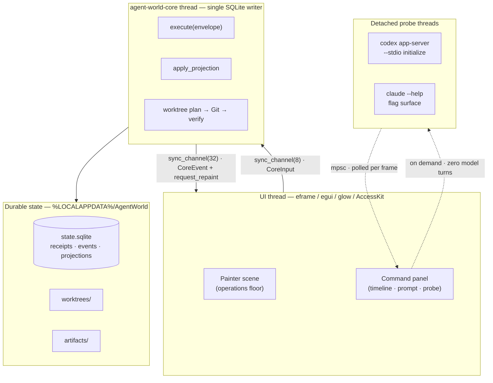
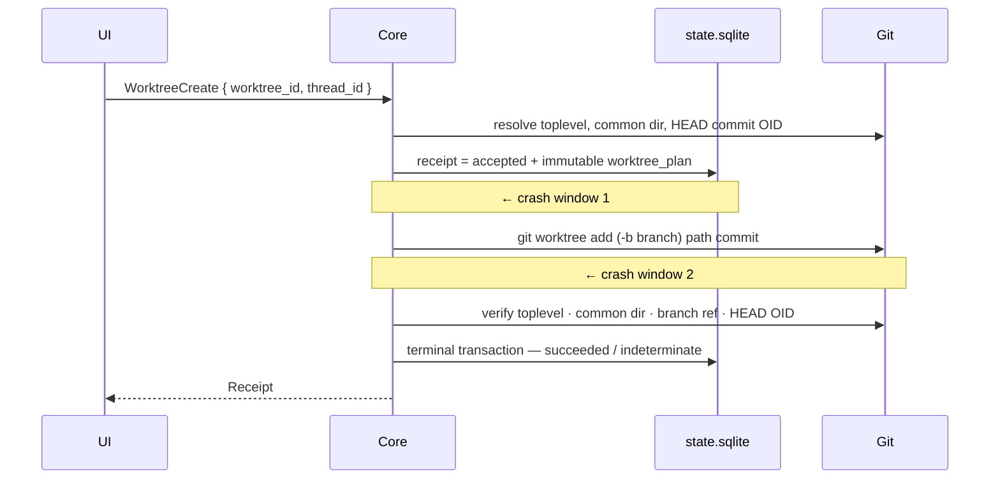

# Architecture

> Agent World is one process, one window, one renderer, one writer thread, and one
> SQLite file. Everything below is an explanation of why that is enough — and what it
> refuses to do to stay that way.

---

## 1. Shape of the process



Three kinds of thread exist, and no more:

| Thread | Count | Owns |
|---|---:|---|
| UI | 1 | The window, the scene, all `egui` state |
| `agent-world-core` | 1 | The SQLite connection, Git invocation, projections |
| Provider probe | 0 or 1, transient | A short-lived child process, then exits |

There is no thread pool, no async runtime, no process per actor, and no Node. Fifty
visible operators are fifty rows in a table, not fifty processes — which is the whole
reason the idle CPU figure has a decimal point in front of it.

---

## 2. Bounded queues, on purpose

```rust
const COMMAND_CAPACITY: usize = 8;   // UI → core
const EVENT_CAPACITY:   usize = 32;  // core → UI
```

Both directions are `std::sync::mpsc::sync_channel`. The UI submits with `try_send`
and surfaces the error rather than blocking the frame; a full queue is a visible
condition, not an invisible backlog.

This is a design position. An unbounded channel would make the app feel fine right up
until memory ended. A bounded one makes backpressure a thing you can see in the status
bar on the very first frame it happens.

The core wakes the UI explicitly — `wake_ui()` calls `request_repaint()` after each
event. The UI otherwise repaints only while something is genuinely in motion
(`request_repaint_after(66ms)` while a probe runs or an actor is starting, running, or
interrupting). Idle means idle.

---

## 3. Durability model

Every mutation enters as a `CommandEnvelope`: a `command_id`, a `PROTOCOL_VERSION`, and
a serialized `Command`. The core writes a **receipt** before anything else, and the
receipt is the unit of idempotency.

```
command_receipts   command_id PK · protocol_version · command_json · status
                   · result_json · event_sequence · recorded_at
events             sequence PK AUTOINCREMENT · aggregate_id · aggregate_version
                   · event_type · payload_json   UNIQUE(aggregate_id, aggregate_version)
worktree_plans     command_id PK → command_receipts · repo_path · repo_common_dir
                   · branch · path · commit_oid
aggregate_versions aggregate_id PK · version
projects           project_id PK · name · repo_path
worktrees          worktree_id PK · project_id → projects · branch · path UNIQUE · status
threads            thread_id PK · project_id → projects · worktree_id → worktrees
                   · provider · label · state · attention · unread_count
                   · last_event_sequence
messages           sequence PK → events · thread_id → threads · role · body · occurred_at
```

Three properties follow from that layout, and `--self-check` asserts all three:

1. **Replay is free.** Re-executing the same `command_id` with the same payload returns
   the original receipt and appends no second event.
2. **Altered replay is rejected.** Re-executing the same `command_id` with a *different*
   payload is refused rather than applied. A retry that quietly changed its mind is a
   bug in the caller, not an instruction.
3. **Ordering is enforced by the schema.** `UNIQUE(aggregate_id, aggregate_version)`
   makes a lost update a constraint violation instead of a silent overwrite.

`projects`, `worktrees`, `threads`, and `messages` are **projections**. The scene is a
projection of a projection. Nothing is ever true only on screen.

---

## 4. Git worktrees: intent before action

The dangerous part of creating a worktree is not Git. It is the gap between deciding
and doing, and the gap between doing and recording. Agent World commits the plan first,
so both gaps are recoverable.



On startup, `recover_accepted_worktrees()` replays every plan still sitting in
`accepted` and drives it to a terminal state:

- **Crash window 1** (durable acceptance, no Git yet) — the plan is complete, so the
  worktree is created on the next launch and verified.
- **Crash window 2** (Git ran, no terminal transaction) — the path already exists, so
  recovery verifies rather than recreates.

Verification is exact, not approximate. Four things must match the plan: the resolved
toplevel path, the Git common directory, `refs/heads/<branch>`, and the HEAD commit
OID. If the branch already exists and points somewhere else, Agent World stops with
`worktree branch X points to Y, expected Z; refusing to reset it`.

**Mismatch becomes `indeterminate`.** It does not `reset --hard`, prune, delete, or
force. An agent runner that silently repairs your Git state is a tool that will
eventually silently delete your work.

---

## 5. Providers: probed, not pretended

Live model turns are disabled in the UI. What ships instead is a **zero-turn probe** of
the protocol surface the installed CLIs actually declare — `--probe-providers` reports
`"paid_model_turns": 0` because the probe never starts one.

**Codex** — resolves the real `codex.exe` behind the npm `.cmd` shim, runs a full
`initialize` handshake over `app-server --stdio` with an 8-second deadline, and requires
the response to carry `userAgent`, `codexHome`, `platformFamily`, and
`platformOs == "windows"`. It then generates the protocol JSON schema and asserts the
installed build declares `thread/start`, `thread/resume`, `thread/fork`, `turn/start`,
`turn/interrupt`, plus `item/commandExecution/requestApproval` and
`item/tool/requestUserInput`.

**Claude** — asserts the installed CLI exposes `--input-format`, `stream-json`,
`--output-format`, `--session-id`, `--resume`, `--fork-session`, and
`--permission-mode`.

Each probe reports three separate lists, and the separation is the point:

| Field | Means |
|---|---|
| `verified_without_model_turn` | Agent World executed this and it worked |
| `declared_by_installed_cli` | The installed binary says it supports this |
| `live_spike_still_required` | Nobody has proven this yet, including us |

Streamed turns, approval round-trips, interrupt-during-generation, and resume/fork
context integrity all sit in the third column. They stay there until a live spike moves
them.

---

## 6. Renderer

`eframe` with `default-features = false` and exactly three features: `accesskit`,
`default_fonts`, `glow`.

The first shell used DX12 via `wgpu` and measured **366.45 MB** private memory. It was
deleted rather than optimized. `glow` is the production renderer and there is no second
backend to keep alive, no feature flag to test twice, and no "it works on the other
path" bug class.

The scene itself is immediate-mode `Painter` output — rectangles, circles, and text, no
retained scene graph. Hit-testing is one `ui.interact` per station. Selection,
attention cycling, prompting, and interruption are keyboard-reachable, and AccessKit is
on.

Release profile: `codegen-units = 1`, `lto = "thin"`, `panic = "abort"`, `strip = true`.

---

## 7. What is deliberately absent

| Not here | Why |
|---|---|
| Async runtime | One writer thread and blocking `mpsc` are sufficient and legible |
| Second renderer | Measured, rejected, deleted |
| Node, Electron, webview | The resource gate is the product |
| Process per actor | Actors are rows; the measurement script asserts this |
| Live model turns | Not yet proven end-to-end, so not yet claimed |
| Autonomous agent-to-agent loops | Handoffs will be directed and user-confirmed |
| Cross-platform builds | `where.exe`, `%LOCALAPPDATA%`, and Windows path handling are load-bearing today |

---

## 8. Verifying all of this yourself

```powershell
.\target\release\agent-world.exe --self-check        # idempotency, conflict rejection, both crash windows
.\target\release\agent-world.exe --probe-providers   # protocol surface, zero model turns
.\scripts\measure.ps1 -WarmupSeconds 300 -SampleSeconds 60
```

`--self-check` builds disposable Git repositories under `%TEMP%` and configures its own
committer identity, so it touches nothing you own. `measure.ps1` seeds a unique
temporary runtime root, refuses to run against a path outside `%TEMP%\AgentWorldResource-*`,
and removes it afterwards.

Run them. Disagreeing with the numbers is a supported activity — see
[CONTRIBUTING.md](../CONTRIBUTING.md).
